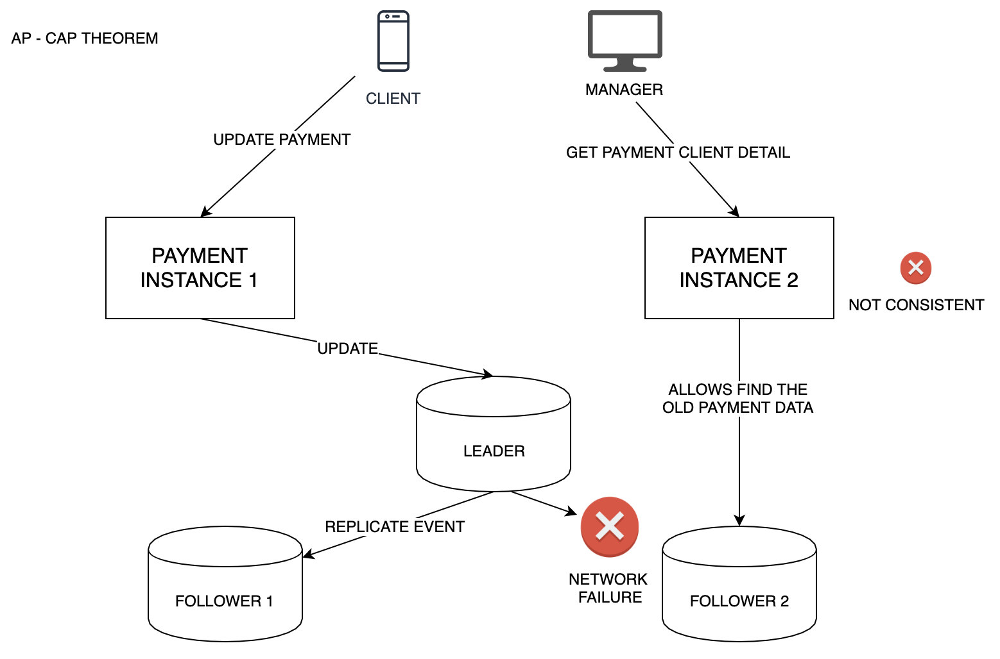
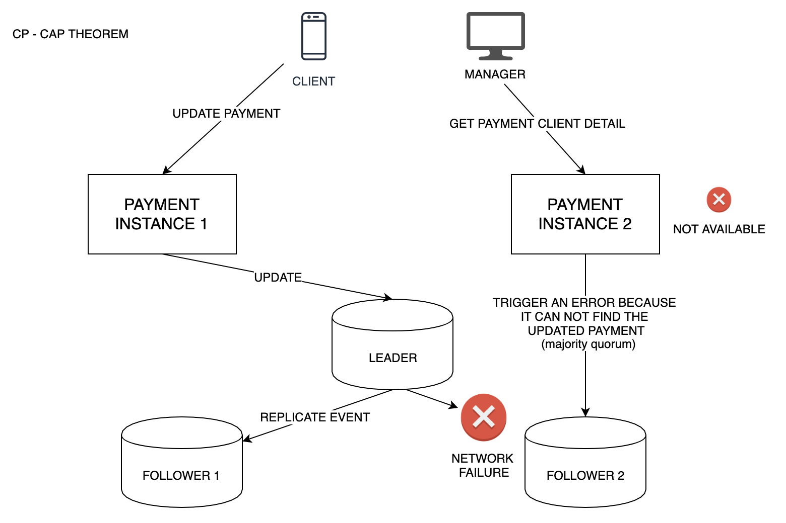

# CAP Theorem
This project has some examples of the CAP theorem

Can have only 2 of 3

# Examples 

## AP - Availability and Partition tolerance

## CP - Consistency and Partition tolerance

## But Never Both (CA - Consistency and Availability) 

*You cannot, however, choose both consistency and availability in a distributed system.*

As a thought experiment, imagine a distributed system which keeps track of a single piece of data using three nodes—AA, BB, and CC—and which claims to be both consistent and available in the face of network partitions. Misfortune strikes, and that system is partitioned into two components: \lbrace A,B \rbrace{A,B} and \lbrace C \rbrace{C}. In this state, a write request arrives at node CC to update the single piece of data.

That node only has two options:

Accept the write, knowing that neither AA nor BB will know about this new data until the partition heals.
Refuse the write, knowing that the client might not be able to contact AA or BB until the partition heals.
You either choose availability (Door #1) or you choose consistency (Door #2). You cannot choose both.

To claim to do so is claiming either that the system operates on a single node (and is therefore not distributed) or that an update applied to a node in one component of a network partition will also be applied to another node in a different partition component magically.

## Notes 

# Distributed Systems

- Non-critical and cheap x expensive and reliable
- Faults and maintenance can be handled in a node level

# Reliability
When something goes wrong in system it called fault, fault is a component of the system that is not working as expected, 
failure is when the system as a whole stop to provide a service to user or another system.
A good system design is focused in be fault-tolerant, avoiding faults you prevent the failures.

# Scalability (Requeriment Describing Load/Analyze Performance when load increases)
scaling up (vertical scaling – powerful machine) or scaling out (horizontal scaling – distributed load between smaller machines)

# Maintainability

- The majority cost of the system is not in the initial development but in the maintenance 
(fixing bugs, failures, modifying it for new use cases, technical debt, etc).

- Operability: Make it easy for operations team maintenance.

- Simplicity: Make it easy for new engineers understand the system.

- Evolvability: Make it easy for engineers make system changes in the future. It is known as extensibility, modifiability and plasticity.

# Replication

- High Availability
- Disconnected operations
- Latency
- Scalability

- Single-leader replication -> all writes go to one node(the leader) send stream change data to the followers(reads can be performed from any follower)but data can be stale(old)
- Multi-leader replication -> all writes go to one of several leader nodes, this node send stream change data to the other leaders and followers(reads can be performed from any follower)but data can be stale(old)
- Leaderless replication -> all writes go to one of several nodes, and read from several nodes in paralles in order to detect and correct nodes with stale data.

- Multi-leader leaderless replication -> weak consistency guarantees, need to use algorithms to resolve and merge write conflicts

- Synchronous and Asynchronous replication, it can impact in the leader fails in you need to promote a follower to lead, we need to take care of this replication lag(can not be high) 

#### Consistency-models:
- Read-after-write consistency
- Monotomic reads
- Consistency prefix reads

# Transaction

### Transaction isolation levels:

- Read-committed
- Snapshot isolation (repeatable read)
- Serializable

### Race Conditions:

- Dirty Reads - the read commited level avoid dirty reads
- Dirty writes - client override data from another, almost all transaction implementations prevent it. 
- Read skew(nonrepeatable reads) - 
- Lost updates - Select fro update
- Write skew
- Phantom Reads

### Only Serializable isolation prevents against all race conditions.

Implementing Serializable transactions:
- Literally executing transactions in a serial order
- Two-phase locking
- Serializable snapshot isolation

# Synchronous Architecture 

Circuit Breaker avoid a cascade failure when one service fail (ResilientJ4, Netflix Histrix)

# 5 Patterns Data Consistency

## Saga Pattern - compensate operations  
 
 

## Reconciliation- protocol SEPA swift
 Scheduling implementation(check if all data is write)
 Check payment if is ok .. it updates the order microservice as well or delete order if is not paid

 proactive event-based

## Complex process - Application event log

 Orchestration or Choreography 
 Periods of inconsistency
 Implementation complexity

 BASE over ACID 
 Basic Availability
 Soft-state
 Eventual consistency

## Change Data Capture(CDC) - split logic down side

#### Database native tools
 MongoDB Oplog
 PostgreSQL ChangeLog

#### CDC with Kafka Connect / Debezium

## Event First

- Message Broker - RabbitMQ or ActiveMQ
- Message Streams - Kafka or Kinesis - order in the partitions don't have dead queue
- Event Database

*Accept inconsistency (Reports , data analytics, recommendations, statistics)*

# Main points 
### Consistency by design
- Accept inconsistency
- Make operations reversible and idempotent

### Change single datasource at the same time
- Change First(CDC)
- Event-first(EDA & CQRS)

### Saga - compensate & reconcile
- Orchestration 
- Choreography

### Eventual Consistency
The end user and the business owner have to explicitly embrace eventual consistency in the system and realize that in many cases the business doesn't have any problem with this approach, as long as it's explicit. This is important because users might expect to see some results immediately and this might not happen with eventual consistency.
